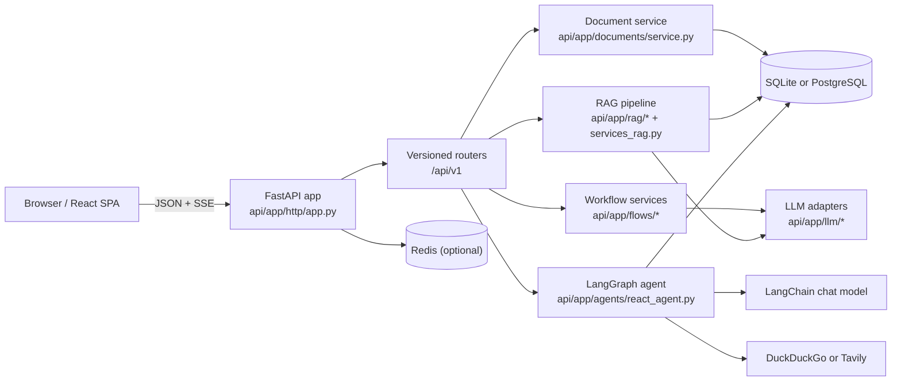

# Architecture

AgentHub is currently implemented as a modular monolith. One asynchronous FastAPI
application handles request admission, tenant resolution, document persistence,
retrieval, workflow execution, and agent orchestration. External dependencies are
limited to the relational database, an optional Redis instance, a configured LLM
endpoint, and an optional web-search provider. There is no separate worker tier,
distributed workflow runner, or external vector database in the current design.

## System Model

| Concern | Implementation |
|--------|----------------|
| API runtime | FastAPI with async request handlers and `ORJSONResponse` default serialization |
| Validation | Pydantic models in `api/app/schemas.py` |
| Persistence | SQLAlchemy asyncio over SQLite or PostgreSQL |
| Cache and rate limiting | Optional Redis, used for best-effort document caching and per-tenant rate limiting |
| LLM transport | Raw `httpx` adapters in `api/app/llm/` for Ollama and OpenAI-compatible APIs |
| Agent runtime | LangGraph `StateGraph` plus LangChain tool bindings |
| Retrieval | In-process chunking, embedding, and cosine-similarity scoring |
| Frontend | React 19 single-page application built with Vite 7 |
| Streaming transport | Server-Sent Events from backend to browser |

Key characteristics:

- **Execution model** - document indexing, retrieval, workflow execution, and agent
  reasoning run inside the request lifecycle. There is no background queue or
  out-of-band worker.
- **Configuration model** - settings are loaded from environment variables through
  `get_settings()` and cached at process scope. Runtime configuration changes require
  a process restart.
- **Tenancy model** - tenant selection is header-driven. The backend trusts the
  configured tenant header and falls back to `DEFAULT_TENANT_ID` when the header is
  absent.
- **Frontend model** - the UI is an operator console over HTTP endpoints, not a
  session-oriented application with user accounts or server-side state.

## Runtime Topology

In development, the React application is served by the Vite dev server and proxies
`/api` and `/metrics` to the backend. In deployments that copy compiled frontend
assets into `api/static`, the FastAPI app can mount and serve the SPA directly.

## Application Assembly

`api/app/main.py` re-exports `app` from `api/app/api.py`. `api/app/api.py` is a
compatibility entrypoint that re-exports `create_app()` and `app` from
`api/app/http/app.py`.

`create_app()` is responsible for:

- configuring structured logging
- instantiating the FastAPI application
- installing HTTP middleware and exception handlers
- registering `/metrics` when Prometheus is enabled
- mounting versioned routers under `API_V1_PREFIX`
- mounting static frontend assets when `api/static` exists

The lifespan hook performs two process-level tasks:

- startup: execute `Base.metadata.create_all()` against the configured database
- shutdown: close the shared Redis client if one was created

Alembic migrations are also present in the repository. In practice, startup DDL is a
bootstrap convenience for local or ephemeral environments, while schema evolution
should still be treated as a migration concern.

### Middleware and Admission Controls

The HTTP layer installs the following cross-cutting concerns:

- **Request context** - generates or propagates `X-Request-ID` and binds it into
  `structlog` context variables.
- **CORS** - driven by `CORS_ALLOWED_ORIGINS`; `"*"` remains the default.
- **Security headers** - `X-Content-Type-Options`, `X-Frame-Options`,
  `Referrer-Policy`, and HSTS in production.
- **Prometheus metrics** - optional request counters and latency histograms.
- **Rate limiting** - optional Redis-backed sliding-window limit keyed only by
  tenant ID and applied to `/api/v1/*`.
- **API key enforcement** - optional shared-secret check on `/api/v1/*` and
  `/metrics`, with `/health` explicitly exempt.

Redis-backed behaviors are intentionally fail-open: if Redis is unavailable, request
processing continues without blocking the caller.

### Request Lifecycle

For a typical JSON request:

1. The request enters FastAPI and passes through middleware.
2. The tenant dependency resolves the tenant ID from the configured header or default.
3. FastAPI validates the request body against a Pydantic schema.
4. A request-scoped `AsyncSession` is injected from `get_db_session()`.
5. The router delegates to a domain service, workflow function, RAG service, or
   agent runtime.
6. The handler returns a typed response model or a `StreamingResponse`.
7. Metrics and response headers are attached before the response is flushed.

For streaming endpoints, the last phase changes from JSON serialization to SSE frame
generation in `api/app/http/sse.py`.

## Backend Module Boundaries

| Module | Responsibility |
|--------|----------------|
| `api/app/http/` | Delivery layer: app factory, middleware, dependencies, SSE helpers, routers |
| `api/app/documents/` | Document creation, lookup, duplicate detection, and upload normalization |
| `api/app/rag/` | Chunking, embeddings, retrieval, and document indexing primitives |
| `api/app/flows/` | Prompt-specialized workflow execution and audit persistence helpers |
| `api/app/llm/` | Provider adapters, shared result types, and provider-specific error classes |
| `api/app/agents/` | LangGraph graph assembly, tool definitions, prompt wiring, and fallback logic |
| `api/app/services_rag.py` | Answer-generation wrapper around retrieval output |
| `api/app/services_ai_flows.py` | Compatibility facade over `api/app/flows/` |
| `api/app/services_llm.py` | Compatibility facade and singleton `LLMClient` |
| `api/app/db.py`, `models.py`, `schemas.py` | Persistence, data model, and request/response contracts |

The three `services_*` modules remain as compatibility surfaces to avoid breaking
imports while the internal architecture is organized around smaller domain packages.

## Persistence Model

### Tables

| Table | Purpose | Notes |
|-------|---------|-------|
| `documents` | Stores source documents | `id`, `tenant_id`, `title`, `text`, `created_at` |
| `document_chunks` | Stores retrieval chunks and embeddings | `document_id`, `tenant_id`, `chunk_index`, `text`, `embedding`, `created_at` |
| `ai_call_audit` | Stores workflow audit records | request payload, response payload, success flag, tenant, timestamp |

### Storage Invariants and Caveats

- Every persisted model includes `tenant_id`, and application reads are filtered by
  tenant.
- `documents.id` is a single-column primary key. As a result, document identifiers are
  globally unique across the entire deployment, even though the application treats
  reads and writes as tenant-scoped. If the platform needs duplicate document IDs per
  tenant, the schema must change to either a composite uniqueness constraint on
  `(tenant_id, id)` or a surrogate primary key plus a tenant-scoped unique index.
- `document_chunks.document_id` is a logical relationship to `documents.id`; it is not
  currently enforced by a database foreign key.
- Embeddings are stored as JSON arrays for SQLite portability. Similarity search is
  therefore executed in Python rather than in the database engine.
- Audit payloads are stored as JSON blobs. This preserves request and response detail
  for debugging, but it is not optimized for analytical querying.

## LLM Integration Layer

`api/app/services_llm.py` exposes a singleton `LLMClient`. Internally it delegates to
provider adapters in `api/app/llm/providers.py`.

The provider layer is responsible for:

- selecting the transport based on `LLM_PROVIDER`
- issuing HTTP requests with `httpx.AsyncClient`
- applying retry policy with exponential backoff for transport errors and timeouts
- normalizing responses into `LLMResult`
- parsing provider-specific streaming formats
- emitting Prometheus latency and error metrics

Two provider families are supported:

- **Ollama** - uses `/api/generate`, with newline-delimited JSON for streaming
- **OpenAI-compatible** - uses `/v1/chat/completions`, with SSE-style `data:` frames

`LLMClient` also wraps provider calls in circuit breakers. Open circuit state prevents
new calls before network I/O is attempted.

The agent stack uses a separate integration path in `api/app/agents/chat_models.py`.
That module constructs provider-specific LangChain chat model instances because the
LangGraph tool-calling loop needs provider-native LangChain objects rather than the
lower-level `LLMClient` abstraction.

## Agent Runtime

The agent implementation in `api/app/agents/react_agent.py` is a request-local ReAct
loop built on LangGraph.

Core design points:

- The graph state is `messages`, implemented as an append-only sequence of LangChain
  message objects.
- The compiled graph has two active nodes:
  - `agent` - invokes the chat model with the fixed ReAct system prompt and tool
    bindings
  - `tools` - executes tool calls through `ToolNode`
- Control alternates between `agent` and `tools` until the latest AI message no longer
  contains tool calls.

Available tools:

- `calculator_tool` - safe expression evaluation for arithmetic
- `search_tool` - DuckDuckGo by default, Tavily when configured
- `document_lookup` - request-scoped document fetch injected by the router

Additional behavior:

- `_translate_math_intent()` bypasses the LLM for common natural-language arithmetic
  requests such as average, sum, and product.
- `document_lookup` is created per request so tool execution remains tenant-filtered
  without relying on global state.
- If the graph returns empty or malformed content, the agent falls back to web search
  plus summarization.
- Conversation state is not persisted. Each API call starts a fresh graph with only the
  current user message and any tool interactions produced during that request.

The streaming endpoint uses `graph.astream(..., stream_mode="messages")` and emits only
assistant content chunks. It does not expose a structured event stream of tool traces
or intermediate graph state.

## Retrieval Pipeline

The retrieval stack consists of `api/app/rag/` plus `api/app/services_rag.py`.

### Indexing Path

`RAGPipeline.index_document()` performs the following steps:

1. Chunk the document with `chunk_text(text, chunk_size=500, chunk_overlap=50)`.
2. Generate embeddings concurrently with `asyncio.gather(...)`.
3. Delete existing chunk rows for the same tenant and document ID.
4. Insert the newly generated chunk rows into `document_chunks`.

This makes indexing idempotent at the application level for a given tenant and
document ID.

### Query Path

`RAGPipeline.retrieve()` performs:

1. embed the query text
2. select all candidate chunks for the tenant, optionally filtered by `document_ids`
3. compute cosine similarity in Python for each candidate row
4. maintain a top-k heap instead of sorting the full candidate set
5. return the best-scoring chunk payloads

`run_rag_query_flow()` then assembles a context block from the returned chunks, caps
the prompt context to 8000 characters, and calls the configured LLM to produce the
final answer.

Important current constraints:

- The default embedding implementation is deterministic mock embedding based on SHA-256
  hashing. This is useful for testing and local development but not semantically strong
  enough for production retrieval quality.
- Retrieval still scans every candidate chunk in Python. The heap optimization removes
  full-list sorting cost, but it does not remove the linear scan across the candidate
  set. This is the main scaling limit of the current RAG design.
- The platform does not yet use a dedicated vector index such as pgvector, FAISS, or an
  external vector database.

## Workflow Services

The prompt-specialized workflows live in `api/app/flows/` and are exposed through
`/ai/notary/summarize`, `/ai/classify`, `/ai/ask`, and `/ai/ask/stream`.

Shared workflow behavior:

- inputs are sanitized before prompt construction
- request payloads and responses are written to `ai_call_audit` for non-streaming flows
- audit persistence is best-effort; workflow responses are still returned if audit
  writes fail
- when the LLM path fails, workflows return a structured fallback response instead of
  propagating raw provider errors

Workflow-specific behavior:

- **Notary summarization** - may replace the supplied text with the body of the
  referenced document when `document_id` is present and found. It returns a structured
  response object, but the current implementation does not parse the LLM output into a
  deeply structured schema; it wraps the raw summary into a fixed response shape.
- **Classification** - prompts for a single label from a caller-provided label list and
  maps the first returned token back to the nearest valid label. On fallback, it chooses
  the first candidate label.
- **Ask** - performs grounded Q&A over caller-supplied context. The non-streaming path
  writes audit records; the streaming path does not currently persist audit output.

## Frontend Control Plane

The frontend in `frontend/` is a React 19 single-page application with local tab state.
It is intentionally thin and acts as an operator console rather than an autonomous
frontend business layer.

Technical characteristics:

- no client-side router; the active surface is selected in component state
- typed request wrappers in `frontend/src/api.ts`
- default tenant propagation via `X-Tenant-ID`
- optional API key propagation via `X-API-Key`
- browser-side SSE consumption via `ReadableStream` parsing
- development proxying through Vite to the backend

The UI does not currently provide:

- end-user authentication or session management
- persisted chat history
- offline state management
- a normalized client-side cache

## Security, Tenancy, and Observability

### Security and Tenancy

- Tenant selection is based on a trusted header. The backend does not currently bind
  API keys to tenants or perform per-user authorization.
- API key protection is optional and global. It behaves like a shared service secret,
  not a user identity system.
- Input sanitation is applied to workflow and agent inputs before prompt construction.
- Document upload accepts UTF-8 text only. The platform does not currently parse PDFs,
  Office documents, OCR input, or arbitrary binary content.

### Observability

Prometheus metrics include:

- request counts and latency
- LLM counts, latency, and provider errors
- circuit-breaker state and failure totals
- agent execution and tool-call counters
- security validation and block counters

Health checks are intentionally lightweight:

- database health is a `SELECT 1`
- Redis health is a `PING` when Redis is configured
- `llm_ok` only reports whether the LLM client is configured, not whether a live model
  completion succeeds

The `/health` response always reports `status="ok"` and uses individual boolean fields
to expose subsystem status.

## Operational Constraints

The current architecture is straightforward to run, but several constraints are
important for planning:

- no asynchronous job queue, so long-running indexing or model calls consume request
  worker time directly
- no vector database, so retrieval cost grows linearly with chunk count
- no persistent conversation state, so agent interactions are stateless across requests
- no tenant-bound authentication, so multitenant isolation depends on gateway behavior
  and caller discipline
- startup schema creation is convenient for local environments but should not be the
  only schema-management mechanism in production
- frontend tooling targets Node `20.19+` or `22.12+`

Within those constraints, the codebase is now organized around explicit delivery,
domain, retrieval, workflow, and provider boundaries, which makes the current platform
easier to extend toward a more distributed agent architecture when those limits need to
be removed.
